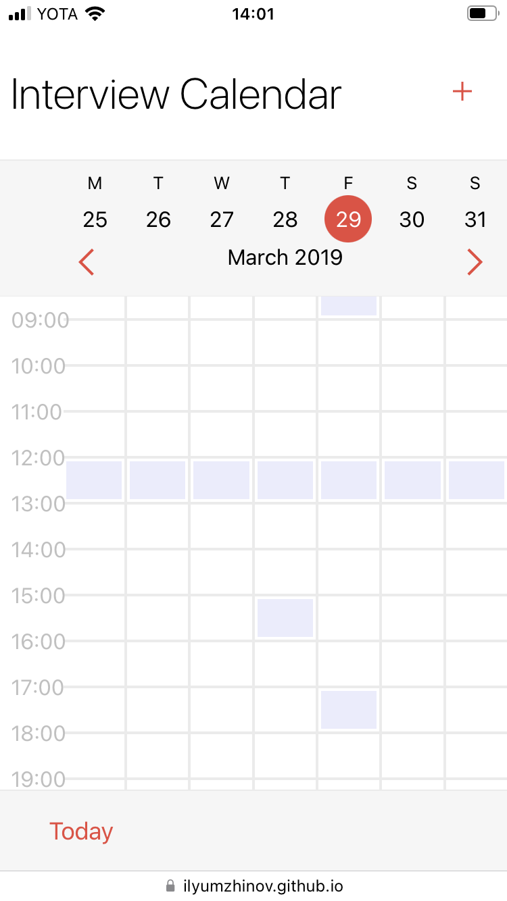
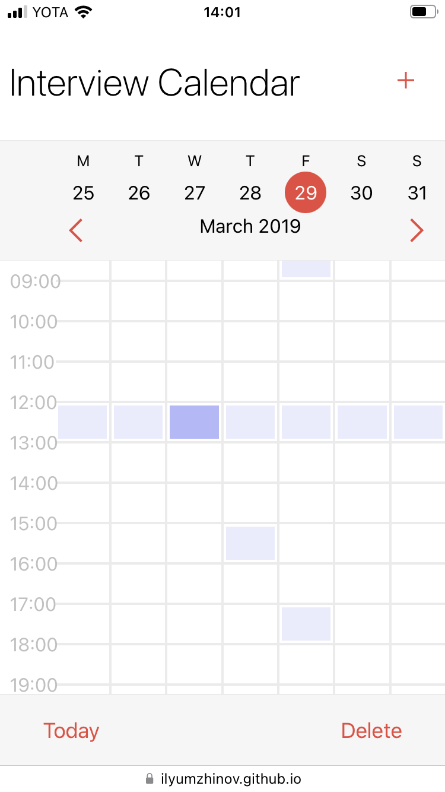
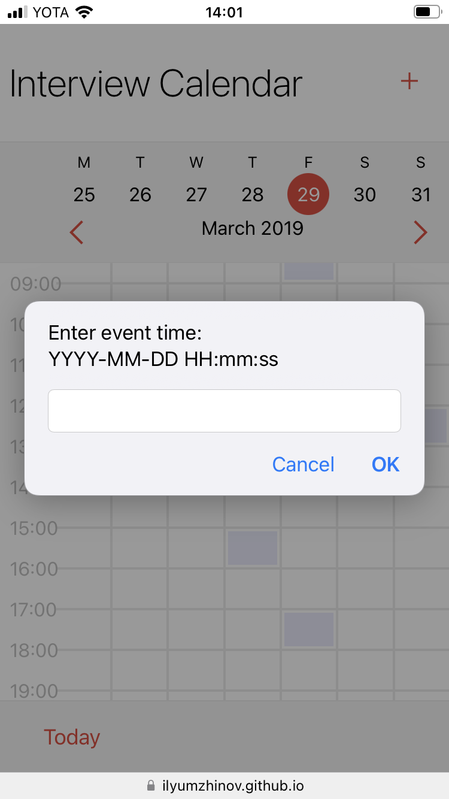

# InterviewCalendar Test Task

Статичная страница приложения календаря, сделанная на React. Поддерживает добавление и удаление событий.

Стек: TypeScript, React v18, create-react-app, styled-components.

Попробовать в браузере: [ilyumzhinov.github.io/InterviewCalendarTestTask](https://ilyumzhinov.github.io/InterviewCalendarTestTask/)

## Установка

```bash
npm install
npm start
```

## Скриншоты

**Главная**



**Удаление события**



**Добавление события**


